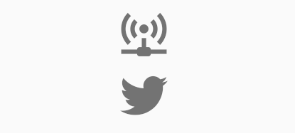
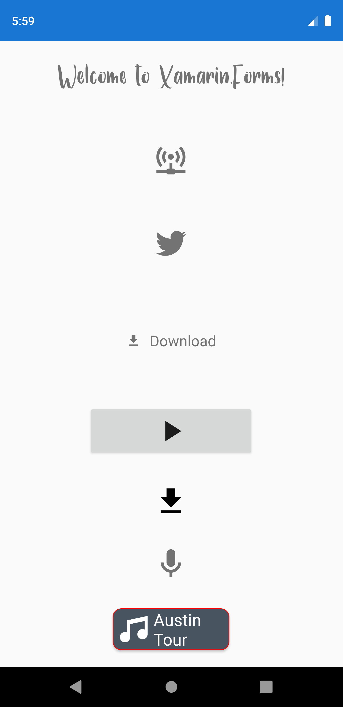

# Custom Font og IconFont som Embedded resource

> [Embedded Fonts: Custom Fonts in Xamarin.Forms](https://devblogs.microsoft.com/xamarin/embedded-fonts-xamarin-forms/)
>
> [Fonts in Xamarin.Forms](https://docs.microsoft.com/en-us/xamarin/xamarin-forms/user-interface/text/fonts)
> 
> [Icon font to Code](https://andreinitescu.github.io/IconFont2Code/)

Icon fonts kan hentes her:
> 
> [Material Design Icons](https://materialdesignicons.com/)
> 
> [Font Awesome](https://fontawesome.com/)

Artikler om ældre måder at benytte IconFonts på, men indeholder vejledning om hvordan man henter font og lignende. Men måden at benytte 
IconFont på er forældet fra Xamarin.Forms 4.5. Og fra version 4.6 virker det rent faktisk!

[Use FontAwesome in a Xamarin.Forms app](https://docs.microsoft.com/en-us/xamarin/xamarin-forms/user-interface/text/fonts)

[Cheatsheet](https://fontawesome.com/v4.7.0/cheatsheet/)

[Using Font Icons in Xamarin.Forms: Goodbye Images, Hello Fonts!](https://montemagno.com/using-font-icons-in-xamarin-forms-goodbye-images-hello-fonts/)


&nbsp;
### 1. Add the font file (otf or ttf) to your shared project and mark it as embedded resource
I folderen Fonts ses en almindelig font: Samantha.ttf og en iconFont: materialdesignicons-webfont.ttf.

*Build Action* sættes til **Embedded resource**.

&nbsp;   
### 2. Add ExportFont attribute in your shared project
I App.xaml.cs, oven over namespace, tilføjes følgende instruktion til assembleren:
```csharp
[assembly: ExportFont("Samantha.ttf")]
[assembly: ExportFont("materialdesignicons-webfont.ttf", Alias = "MaterialFontFamily")]
```
Bemærk at man kan benytte et alias, men ellers er det filnavne, der angives.

&nbsp;

### 3. Consume the new font in your controls
#### Custom font
I View'et kan man benytte en Custom font således:
```xml
<Label Text="Welcome to Xamarin.Forms!"
        FontFamily="Samantha"/>
```
Her ses resultatet:


#### Icon Font
Udfordringen er at finde den korrekte kode for et ikon. Her benyttes værktøjet: [IconFont2Code](https://andreinitescu.github.io/IconFont2Code/)
Når man åbner font-filen vha. værktøjet, kan man finde UniCode. Et af de første ikoner, access-point-network, har koden: `\U000f0002`. Den skal
imidlertid escapes for at kunne benyttes af XAML og kommer til at hedde: `&#xf0002;`:

**Label**
```xml
<Label FontFamily="MaterialFontFamily" 
       Text="&#xf0002;" />
```

Ofte vil man definere et ikon som en resource, her i Page.Content:
```xml
<ContentPage.Resources>
    <x:String x:Key="IconTwitter">&#xf0544;</x:String>
</ContentPage.Resources>
```
Og her benyttes resourcen:
```xml
<Label FontFamily="MaterialFontFamily" 
        Text="{StaticResource IconTwitter}" />
```

Her ses de to ikoner:



**Button**
Her er tilføjet et ikon sammen med noget tekst. Teksten kan ikke sættes på i XAML og derfor gøres det i resource-definitionen:
```xml
<Button FontFamily="MaterialFontFamily"  
        Text="{StaticResource IconPlay}"              
        FontSize="20"
        WidthRequest="200"
        VerticalOptions="CenterAndExpand"  
        HorizontalOptions="Center"/>
```

**Image**
Her ses et ikon samt en tekst anbragt i et image:
```xml
<Image
    HeightRequest="22"
    HorizontalOptions="Center"
    VerticalOptions="Center">
    <Image.Source>
        <FontImageSource
            FontFamily="MaterialFontFamily"
            Glyph="{StaticResource IconDownload}"
            Size="22" Color="Black" />
    </Image.Source>
</Image>
```

**Med en C# static class**
Vha. IconFont2Code værktøjet kan man let generere en static C# klasse med de ikoner, man ønsker. I eksempel-projektet ligger 
der en fil i Fonts-folderen, der hedder IconFont.cs.

Man får fat i et ikon vha. `x:Static` og har man sat en `xmlns` op til at pege på Fonts-folderen, kan man browse sig frem:
```xml
xmlns:icons="clr-namespace:IconFontDemo.Fonts"
....

<Label FontFamily="MaterialFontFamily" 
       Text="{x:Static icons:IconFont.Microphone}" />
```

Til sidst vises et eksempel på hvordan man kan lave en "button", som kan styles:
```xml
        <Frame CornerRadius="10" BackgroundColor="#485460" HorizontalOptions="CenterAndExpand" VerticalOptions="End" 
               Margin="0,0,0,20"  HeightRequest="50" WidthRequest="140" OutlineColor="Red" HasShadow="True" Padding="0" >
            <StackLayout Orientation="Horizontal">
                <Label Text="{x:Static icons:IconFont.Music}"
                    FontFamily="MaterialFontFamily"
                    HorizontalOptions="Center"
                    VerticalOptions="Center"
                    FontSize="20"
                    FontAttributes="None"
                    Margin="5,0,0,0"     
                    TextColor="White" />
                <Label Text="Austin Tour" FontSize="20"  TextColor="White"  HorizontalOptions="End" VerticalOptions="Center" />
            </StackLayout>
            <Frame.GestureRecognizers>
                <TapGestureRecognizer Command="{Binding OpenTour}"/>
            </Frame.GestureRecognizers>
        </Frame>
```
Her ses hvordan ovenstående eksempler ser ud på skærmen:

