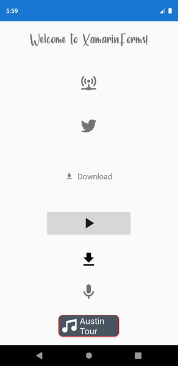

# Custom Font og IconFont som Embedded resource

> [Xamarin.Forms Custom Fonts Simplified & Everywhere](https://montemagno.com/xamarin-forms-custom-fonts-everywhere/)
>
> [Fonts in Xamarin.Forms](https://docs.microsoft.com/en-us/xamarin/xamarin-forms/user-interface/text/fonts)
> 
> [Icon font to Code](https://andreinitescu.github.io/IconFont2Code/)
> 
> [Cheatsheet for FontAwesome](https://fontawesome.com/v4.7.0/cheatsheet/)

Icon fonts kan hentes her:
> 
> [Material Design Icons](https://materialdesignicons.com/)
> 
> [Font Awesome](https://fontawesome.com/)

**Kommende NuGet pakke, med komplet løsning:**
[Icon Fonts made Easy (Dan Siegel)](https://dansiegel.net/post/2020/05/07/icon-fonts-made-easy)

&nbsp;
### 1. Add the font file (otf or ttf) to your shared project and mark it as embedded resource
I folderen Fonts det sharede projekt ses en almindelig font: `Samantha.ttf` og en iconFont: `materialdesignicons-webfont.ttf`, samt nogle FontAwesome fonte.

*Build Action* sættes til **Embedded resource** for alle fonte.

&nbsp;   
### 2. Add ExportFont attribute in your shared project
I `AssemblyInfo.cs` (eller App.xaml.cs oven over namespace), tilføjes følgende instruktion til assembleren:
```csharp
[assembly: ExportFont("Samantha.ttf")]
[assembly: ExportFont("materialdesignicons-webfont.ttf", Alias = "MaterialFontFamily")]
[assembly: ExportFont("Font-Awesome-5-Brands-Regular-400.otf", Alias = "FA-brands-regular")]
[assembly: ExportFont("Font-Awesome-5-Free-Regular-400.otf", Alias = "FA-regular")]
[assembly: ExportFont("Font-Awesome-5-Free-Solid-900.otf", Alias = "FA-solid")]
```
Bemærk at man kan benytte et alias, men ellers er det filnavne, der angives. Man behøver selvfølgelig kun at tage de fonte med, som
man rent faktisk har brug for.

&nbsp;

### 3. Consume the new font in your controls
#### Custom font
I View'et kan man benytte en Custom font således:
```xml
<Label Text="Welcome to Xamarin.Forms!"
        FontFamily="Samantha"/>
```
Her ses resultatet:


### Icon Font
Udfordringen er at finde den korrekte kode for et ikon. Her benyttes værktøjet: [IconFont2Code](https://andreinitescu.github.io/IconFont2Code/)
Når man åbner font-filen vha. værktøjet, kan man finde UniCode. Et af de første ikoner, *access-point-network*, har koden: `\U000f0002`. Den skal
imidlertid escapes for at kunne benyttes af XAML og kommer til at hedde: `&#xf0002;`:

**Label**

Her er benyttet den "rå" Unicode:
```xml
<Label FontFamily="MaterialFontFamily" 
       Text="&#xf0002;" />
```

Ofte vil man definere et ikon som en resource, her i `Page.Content`. Men man kan også oprette en global resource i App.xaml:
```xml
<ContentPage.Resources>
    <x:String x:Key="IconTwitter">&#xf0544;</x:String>
</ContentPage.Resources>
```
Og her benyttes resourcen:
```xml
<Label FontFamily="MaterialFontFamily" 
        Text="{StaticResource IconTwitter}" />
```

Her ses de to ikoner:


&nbsp;

**Label med kombineret icon og tekst**
```xml
<Label  FontFamily="MaterialFontFamily" FontSize="Medium">
    <Label.FormattedText>
        <FormattedString>
            <Span Text="{StaticResource IconDownload}"/>
            <Span Text=" " />
            <Span Text="Download"/>
        </FormattedString>
    </Label.FormattedText>
</Label>
```

&nbsp;

**Button**

Her er tilføjet et ikon sammen med noget tekst:
```xml
<Button FontFamily="MaterialFontFamily"  
        Text="{StaticResource IconPlay}"              
        FontSize="20"
        WidthRequest="200"
        VerticalOptions="CenterAndExpand"  
        HorizontalOptions="Center"/>
```

&nbsp;

**Image**
Her ses et ikon samt en tekst anbragt i et image:
```xml
<Image
    HeightRequest="22"
    HorizontalOptions="Center"
    VerticalOptions="Center">
    <Image.Source>
        <FontImageSource
            FontFamily="MaterialFontFamily"
            Glyph="{StaticResource IconDownload}"
            Size="22" Color="Black" />
    </Image.Source>
</Image>
```

&nbsp;

### Med en C# static class
Skal man bruge flere ikoner kan det hurtigt blive et stort arbejde at lave ressourcerne.

Vha. **IconFont2Code** værktøjet kan man let generere en static C# klasse med enten alle eller blot de ikoner man ønsker. I eksempel-projektet ligger 
der to filer i Fonts-folderen:
- **FAIconFont.cs** og som indeholder en static klasse `FontAwesome.IconFont` som indeholder alle ikoner fra *Font-Awesome-5-Free-Solid-900.otf*
- **MDIconFont.cs** og som indeholder en static klasse `MaterialDesign.IconFont` som indeholder alle ikoner fra *materialdesignicons-webfont.ttf*


Man får fat i et ikon vha. `x:Static` og har man sat et namespace `xmlns` op til at pege på font-klassens namespace, kan man browse sig frem:

```xml
xmlns:mdicons="clr-namespace:MaterialDesign"
xmlns:faicons="clr-namespace:FontAwesome"
....

<!--Material Design Icon resources from IconFont class -->
<Label FontFamily="MaterialFontFamily" 
        Text="{x:Static mdicons:IconFont.Microphone}" />

<!--Font Awesome Icon resources from IconFont class -->
    <Label FontFamily="FA-solid" 
        Text="{x:Static faicons:IconFont.Microphone}" />
```


&nbsp;

##### En stylet button
Til sidst vises et eksempel på hvordan man kan lave en "button", som kan styles:
```xml
        <Frame CornerRadius="10" BackgroundColor="#485460" HorizontalOptions="CenterAndExpand" VerticalOptions="End" 
               Margin="0,0,0,20"  HeightRequest="50" WidthRequest="140" OutlineColor="Red" HasShadow="True" Padding="0" >
            <StackLayout Orientation="Horizontal">
                <Label Text="{x:Static icons:IconFont.Music}"
                    FontFamily="MaterialFontFamily"
                    HorizontalOptions="Center"
                    VerticalOptions="Center"
                    FontSize="20"
                    FontAttributes="None"
                    Margin="5,0,0,0"     
                    TextColor="White" />
                <Label Text="Austin Tour" FontSize="20"  TextColor="White"  HorizontalOptions="End" VerticalOptions="Center" />
            </StackLayout>
            <Frame.GestureRecognizers>
                <TapGestureRecognizer Command="{Binding OpenTour}"/>
            </Frame.GestureRecognizers>
        </Frame>
```

&nbsp;

#### Resultat

Her ses hvordan ovenstående eksempler ser ud på skærmen:

